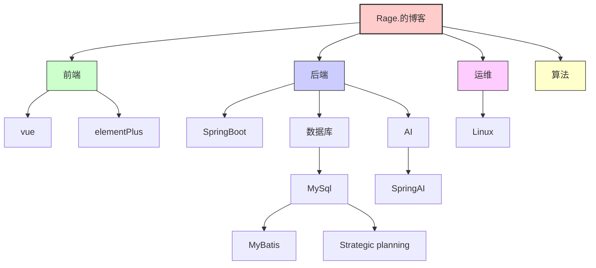
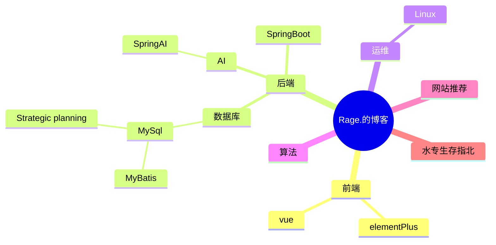

```mermaid
flowchart TD
  root["Rage.的博客"]
  sub1["前端"]
  sub2["后端"]
  sub3["运维"]
  sub4["算法"]

  root --> sub1
  root --> sub2
  root --> sub3
  root --> sub4

  sub1 --> vue["vue"]
  sub1 --> elementPlus["elementPlus"]

  sub2 --> SpringBoot["SpringBoot"]
  sub2 --> 数据库["数据库"]
  数据库 --> MySql["MySql"]
  MySql --> MyBatis["MyBatis"]
  MySql --> Strategic["Strategic planning"]
  sub2 --> AI["AI"]
  AI --> SpringAI["SpringAI"]

  sub3 --> Linux["Linux"]

  %% 样式
  style root fill:#ffcccc,stroke:#333,stroke-width:2px
  style sub1 fill:#ccffcc,stroke:#333,stroke-width:1px
  style sub2 fill:#ccccff,stroke:#333,stroke-width:1px
  style sub3 fill:#ffccff,stroke:#333,stroke-width:1px
  style sub4 fill:#ffffcc,stroke:#333,stroke-width:1px
```

```mermaid
mindmap
  root((Rage.的博客))
    前端
      vue
      elementPlus
    后端
      SpringBoot
      数据库
        MySql
            MyBatis
            Strategic planning
      AI
        SpringAI
    运维
      Linux
    算法
    网站推荐
    水专生存指北
```